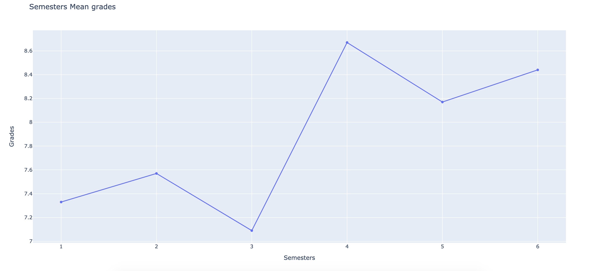
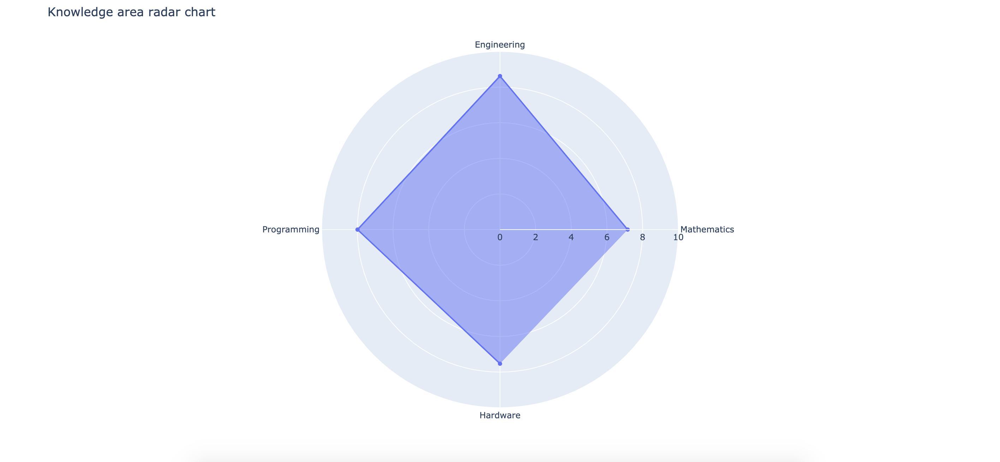

# Computer Engineering [UFPB] (grade analysis)
An easy way to view how grades behaved throughout the semesters, generating a txt and plotting graphs related to grades means and separating the student performance by knowledge area

## Installing
```
pip install selenium
pip install urllib
pip install plotly
pip install statistics
```
[Install a webdriver (same version of your browser)](https://chromedriver.chromium.org/downloads)<br>
##### You might also need to include it in system PATH:<br>
- [MacOSX](https://www.kenst.com/2015/03/including-the-chromedriver-location-in-macos-system-path/)<br>
- [Windows](https://zwbetz.com/download-chromedriver-binary-and-add-to-your-path-for-automated-functional-testing/)<br>
- [Linux](https://makandracards.com/makandra/29465-install-chromedriver-on-linux)

## How to run
The student should pass login and password from [sigaa] as command line arguments
```
python sigaa_grades.py <login> <password>
```
## Results 

______

